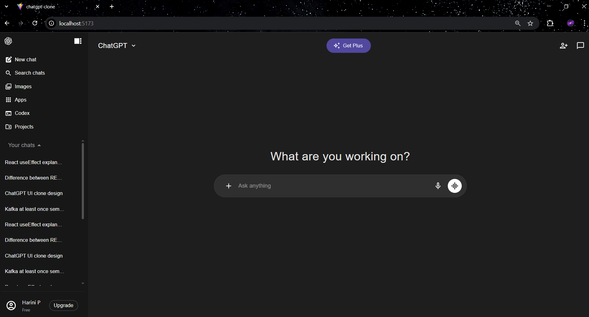
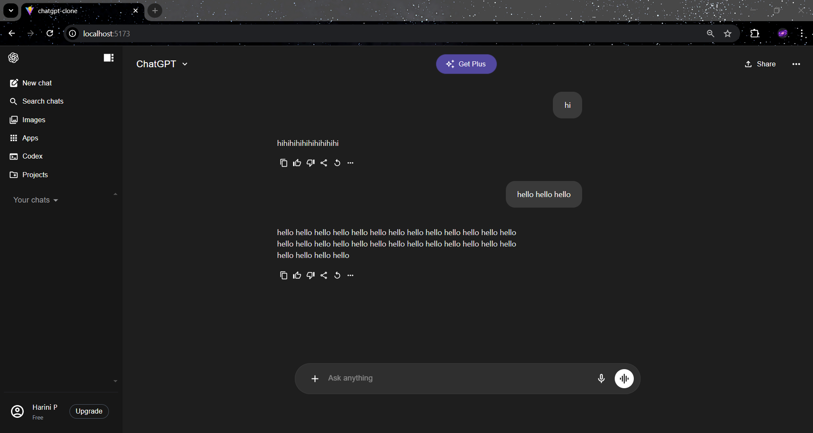
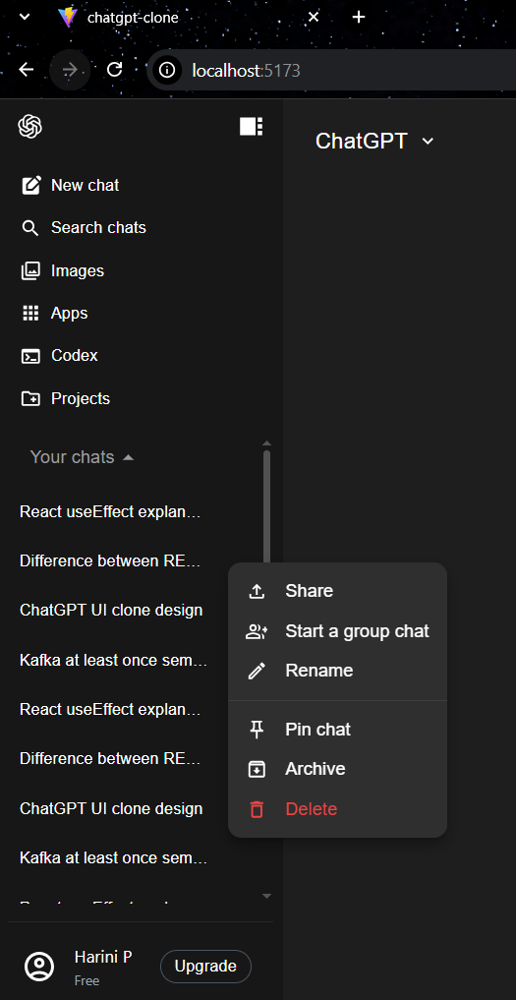
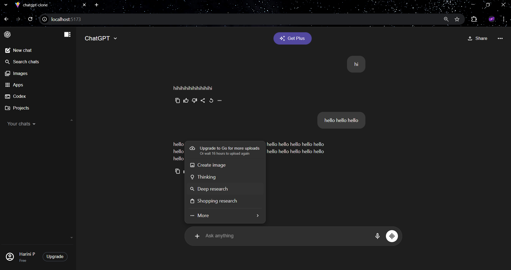
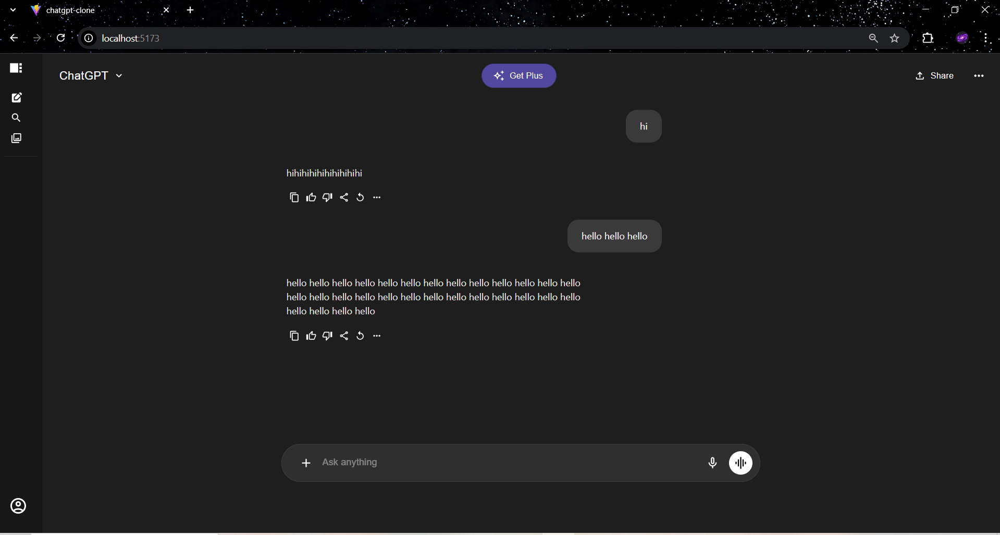

# ChatGPT Clone

A ChatGPT-style user interface built using **React**, **Vite**, and **Material UI**.  
This project focuses on recreating a modern chat application layout with a sidebar, chat panel, popups, search, and new chat functionality.

## Github URL

https://github.com/HariniParam/Chatgpt-clone

## Tech Stack

- **React**
- **Vite**
- **Material UI (MUI)**
- **JavaScript (ES6+)**
- **CSS**

## Features Implemented

### Side Panel
- Displays chat history
- New Chat button
- Search chats functionality
- Tooltip support for icons
- Popup menu for chat actions (rename, delete, archive, share)

### Chat Panel
- Chat UI similar to ChatGPT
- Message input area
- Chat header with actions
- Scrollable conversation area

### Search Feature
- Search chats by title

### New Chat Feature
- Start a fresh chat
- UI updates dynamically

### Popups & Menus
- Custom popup menus using Material UI
- Click-outside to close behavior

### 1. Clone the Repository
```bash
git clone https://github.com/HariniParam/Chatgpt-clone.git
cd Chatgpt-clone
```

### 2. Install Dependencies
```bash
npm install
```
### 3. Run the Development Server
```bash
npm run dev
```
### 4. Open in Browser
```bash
http://localhost:5173
```

## Screenshots

### Chat UI


### Chat Response


### Chat Actions


### File Popup


### Toggle Sidebar

